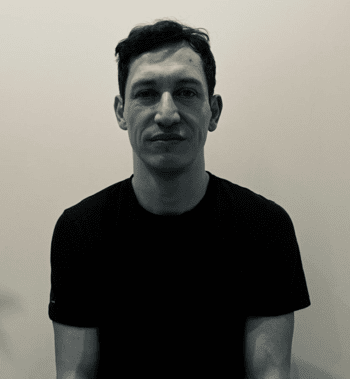

{: style="float: left"} 
Credits:LSS

I am a LSE Fellow at the Department of Government.

Before joining LSE, I was a Postdoctoral Research Fellow at the Development Engagement Lab, based at the University College London.

I received my PhD in Political Science from the University of Oxford, a Master’s in Economics from Queen Mary University of London, and a Master’s in Public Policy from the University of Oxford.

My research interests include political economy of development, behavioural political economy, and indirect questioning techniques.

email:f.torres-raposo(at)lse.ac.uk

Please find my full CV HERE

## UPCOMING PRESENTATIONS: 

- ADD
- ADD

